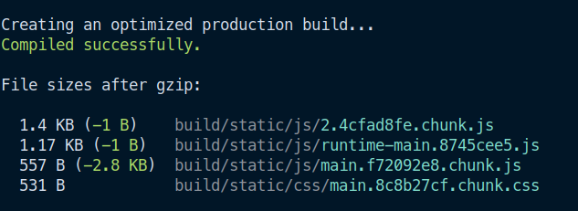

This project is bootstrapped with Create React App

This is a trick(?) which will reduce a react app's build size by a huge fraction.

## TL;DR:

Import react and react-dom dependencies from CDN and use react-script (webpack, babel and typescript) to just transpile the jsx, typescript, sass into plain javascript and css.

## Long Story:

Say you have 10 react apps in your company.
Each app will have its own React and ReactDom library which gets bundled into each app's built files.

Size of React and ReactDom according to Import Cost is:


So basically, in your 10 apps, your users would have to download around 80kb of React and over 1mb of ReactDOM.

## How to overcome this redundancy?

React is a javascript library. We can import React from cdn in our html.

```html
<script
  crossorigin
  src="https://unpkg.com/react@17/umd/react.production.min.js"
></script>

<script
  crossorigin
  src="https://unpkg.com/react-dom@17/umd/react-dom.production.min.js"
></script>
```

And in our react code, instead of import react from node_modules, extract it from the window object.

### in App.tsx

```tsx
const React = window.React;

export default function App() {
  return <div>Hello World?</div>;
}
```

### in index.tsx

```tsx
const React = window.React;
const ReactDOM = window.ReactDOM;

ReactDOM.render(
  <React.StrictMode>
    <App />
  </React.StrictMode>,
  document.getElementById("root")
);
```

As simple as that. Like really. Trust me.

And when you build this app, you get the following build stats.



Impressed? Amazed? In Awe? Me too.

When you serve the build files, browser will download react and react-dom from cdn and will cache it.

And then our react application code is downloaded.

## Advantages:

1. React and React-DOM libraries are downloaded into the browser once and cached. This download will happen only once by one app and the cached library is used by other apps.

1. Faster releases - Since we no longer push react dependency, build files will be very small and will help faster delivery of updates.

1. Since library is downloaded from a different domain (the cdn's), you get advantage of domain sharding.

1. The cached libraries can be used by any react app following this workflow, thus reducing internet usage of the user.

## Disadvantages:

If you are going to use external react libraries, then this approach will be a bit cumbersome.

Most libraries expect react in node_modules of you project. If the library is open source, you might have to change all the import statements in the library and use the modified one.

## Disclaimer:

Seems using Webpack's Module Federation (https://webpack.js.org/concepts/module-federation) is a better solution than this. But cdn solution is much easier.
